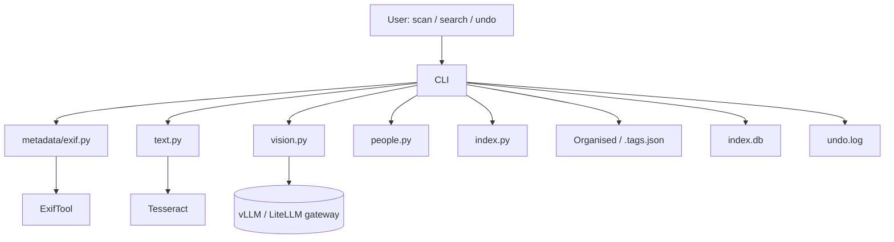
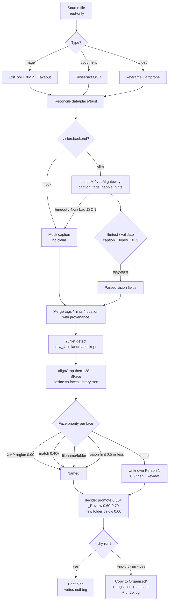
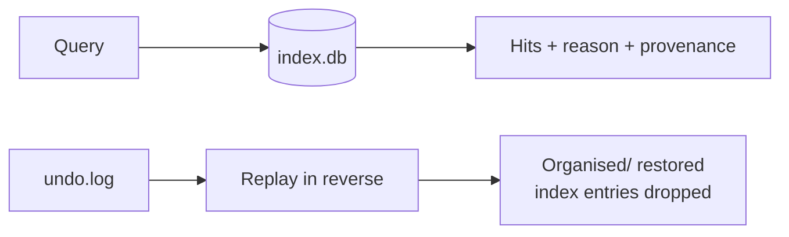

# Photo Archivist Agent

Bank-grade photo/document organiser. Read-only source, copies only, dry-run first,
every write logged + undoable. Full operating rules: see `OPERATING_CONTEXT.md`
(planned).

## Quickstart

```bash
pip install -e . && pip install pytest
brew install exiftool tesseract ffmpeg   # ffmpeg provides ffprobe; apt on Linux

# 1. Dry run (writes nothing)
python -m photo_archivist.cli scan /path/to/source

# 2. Apply after approving the plan
python -m photo_archivist.cli scan /path/to/source --no-dry-run --yes

# 3. Search (every hit carries reason + provenance)
python -m photo_archivist.cli search "Indiranagar branch launch"
python -m photo_archivist.cli search "loan sanction letters from 2023"

# 4. Undo last batch
python -m photo_archivist.cli undo

# 5. Enroll face photos (local template embedding, zero model downloads)
python -m photo_archivist.cli enroll faces                 # bulk folder enrollment
python -m photo_archivist.cli enroll faces/sanjay\ agarwal.png --name "Sanjay Agarwal"

# 6. Environment readiness (binaries / OpenCV faces / vision-LLM / faces library)
python -m photo_archivist.cli check

# 7. Verify the LLM output is PROPER (raw text + parsed JSON + PASS/FAIL checks)
python -m photo_archivist.cli llmtest faces/sanjay\ agarwal.png

# Optional: face-box detection & enrollment (Haar cascade ships INSIDE the wheel — verify
# your corporate proxy allows PyPI first:  pip download --no-deps opencv-python-headless -d /tmp/t )
pip install -e .[faces]
```

Default `vision.backend: mock` makes zero claims. The optional AI backend is any
OpenAI-compatible `/chat/completions` endpoint — a self-hosted vLLM server
(Qwen3-VL) or a LiteLLM gateway (Claude etc) — configured under `vision_llm`
(see *Vision LLM* below). No model is ever downloaded: face detection uses the Haar
cascade bundled inside `opencv-python-headless`, and text vectors are local hashes.

## Layout

```
config.yaml             # all tunable DEFAULTs (thresholds, excludes, hardlink, vision-LLM)
people_library.yaml     # confirmed names + org role map (MD -> Anita Rao ...)
faces_library.json      # face-embedding library (LOCAL ONLY, git-ignored; dormant)
photo_archivist/cli.py  # scan / search / undo / enroll / check
photo_archivist/core/
  detect.py fingerprint.py pipeline.py
  metadata/{exif,docs,video,fs,reconcile,place}.py
  text.py vision.py vllm.py faces.py people.py place.py embed.py
  index.py decide.py organise.py search.py report.py pii.py
tests/  sample_data/  data/
```

Writes go to `Organised/` + `index.db` + sidecar `.tags.json` + `undo.log` only.

## People library (names + org roles, local only)

Two places hold people data — both stay on your machine and are **never uploaded**:

- **`config.yaml`** — baseline defaults:

  ```yaml
  people: {}        # confirmed names, e.g. "Anita Rao": "Managing Director"
  roles:            # role keyword -> person name
    MD: ""
    CFO: ""
  ```

- **`people_library.yaml`** (optional, wins over `config.yaml` if present) — same shape:

  ```yaml
  people:
    "Anita Rao": "Managing Director"
    "Karthik Nair": "Chief Financial Officer"
  roles:
    MD: "Anita Rao"
    CFO: "Karthik Nair"
  ```

**How it is used:**

1. During `search`, if the query mentions a role keyword (e.g. `MD signed letter`),
   `roles` resolves it to a person name and filters the index by that person —
   so `search "MD letter"` behaves like `search "Anita Rao letter"`. Matching is
   whole-word only (`MD` fires, but `MD` inside another word does not) and empty
   role values are ignored.
2. Quoted names in a query (`search '"Anita Rao"'`) are treated as a person filter directly.
3. `people` titles are appended to matched person names in a hit's reason — e.g.
   `Anita Rao [xmp_mwg_region] — Managing Director` — alongside region/LLM/face
   matches stored in `index.db`.


## Facial detection / people model — where to edit

`people: []` in the scan output means **no person data was found**, because people are only
filled from sources that exist:

1. **Embedded metadata** (works today): XMP `MWG:RegionInfo` / `PersonInImage` tags already
   inside the file — `photo_archivist/core/people.py::region_names()` reads them at
   confidence 0.99. Downloaded/social images rarely carry these.
2. **Vision-LLM text hints** (only when `vision_llm.enabled: true`): names literally
   present in OCR text or filenames — recorded with `source: llm_text_extract` at
   confidence ≤ 0.5. The LLM is instructed never to guess identities from faces.
3. **Face detection — boxes only** (✅ live with OpenCV Haar): `faces.py::detect_faces()`
   counts faces and stores `face_boxes` in the record/sidecar. It answers *how many,
   where* — never *who*: no embeddings are produced. Install once with
   `pip install opencv-python-headless` (the cascade XML ships inside the wheel, so
   there is no runtime download). The scan report then shows `faces_pct` and raises
   `UNNAMED-FACE` questions when ≥ `unnamed_face_ask_N` faces have no names.
4. **Face recognition — identity** (⚠️ **dormant, needs an approved embedding source**):
   cosine-matching against `faces_library.json` (`people.py::match_local`) requires
   512-number face embeddings. Producing embeddings needs a recognition model, which
   org policy blocks — so detection runs, matching waits. The wiring stays in place and
   activates the moment embeddings become available.

| What to do | Where / how |
|---|---|
| Populate people from files that already carry names | nothing to do — XMP/EXIF regions are read automatically |
| Populate people from OCR-visible names | `vision.backend: vllm` + `vision_llm.enabled: true` (Vision LLM section) |
| Install face detection | `pip install -e .[faces]` → `python -m photo_archivist.cli check` confirms the bundled cascade |
| Face match strictness | `config.yaml` → `faces.match_threshold: 0.60`, `faces.local_only: true` |
| Raise unnamed-face questions | `config.yaml` → `unnamed_face_ask_N: 3` (ask when ≥ N faces, none named) |

Faces are **local-only** (`faces.local_only: true`): detection runs on your machine,
embeddings never leave it, and `faces_library.json` is excluded from git.

### `faces_library.json` — where it lives (sample)

The path comes from `config.yaml → faces.library`. It is resolved **relative to the folder
you run the CLI from** (normally the repo root):

```
Photo-Archivist-Agent/            ← run commands from here
├── config.yaml                   ← faces.library: faces_library.json
├── people_library.yaml
├── faces_library.json            ← HERE (git-ignored, created by you)
├── photo_archivist/
└── ...
```

Sample contents — a flat JSON object, person name → 512-float face embedding:

```json
{
  "Anita Rao":     [0.0231, -0.1145, 0.0562, "... 512 floats total ...", 0.0872],
  "Karthik Nair":  [-0.0412, 0.0933, 0.0117, "...", -0.0550]
}
```

   inside the file — `photo_archivist/core/people.py::region_names()` reads them at
   confidence 0.99. Downloaded/social images rarely carry these.
   Unmatched boxes become `Unknown Person <n>` placeholders so one batched question
   in `_Review/` names every new face once (see *First run / review loop*).


### Can I install OpenCV Haar on my company laptop? (run these first)

Nothing runs at runtime except the already-installed wheel — but verify your proxy allows
PyPI **once**:

```bash
# 1. Is PyPI reachable through your corporate proxy?
curl -sI https://pypi.org/simple/opencv-python-headless/ | head -1        # expect HTTP/2 200

# 2. Test the DOWNLOAD only (no install, ~60 MB wheel)
pip download --no-deps opencv-python-headless -d /tmp/pf_check && echo ALLOWED || echo BLOCKED

# 3. Install (or: pip install -e .[faces])
pip install opencv-python-headless

# 4. Prove the cascade ships INSIDE the wheel — no second, model-like download:
python -c "import cv2, os; p=os.path.join(cv2.data.haarcascades,'haarcascade_frontalface_default.xml'); print(p, '->', os.path.exists(p))"

# 5. One-shot verdict from the agent itself:
python -m photo_archivist.cli check
```

If step 2 prints `BLOCKED`, face detection is unavailable and the pipeline still runs
(degradation is automatic — `face_boxes` stays empty).

## Reading the `search` output

```
Organised/Inbox/AkhilVerma.jpeg :: Cline / Images (from path) · 2026-10-05T22:37:20 (from fs_birthtime) · text match: Akhil
└─ organised path (or source path)   └─ reason: place (provenance) · date (provenance) · matched terms
```

- Every hit carries a `reason` built from provenance — where each fact came from
  (`path`, `exif`, `fs_birthtime`, face match, etc.).
- Queries are **filtered**, not just ranked: rows are kept only if they actually match a
  term (FTS prefix match, so `Akhil` finds `AkhilVerma.jpeg`, or substring across
  caption/tags/OCR/path/place/event).
- A query that matches nothing prints `No matches.` — expected for text that isn't in your
  library (e.g. `Indiranagar branch launch` on stock avatars with no OCR text).
- Year words (`2023`) are matched broadly against `taken_at`, OCR, caption, tags, and path.


## Dummy vs live — what changed in code to go real

Most components now have **real implementations with graceful fallbacks**: the pipeline always runs,
and each component activates as soon as its dependency or config is present (gazetteer DB file,
vision-LLM endpoint) — nothing is downloaded automatically.

| # | Component | Status now | Code changes made |
|---|---|---|---|
| 1 | **Vision / captions** | ⚙️ **Ready** — mock + OpenAI-compatible gateway | `vision.py::get_backend(name, cfg)` selects `mock` / `vllm` (`llm` = legacy alias of `vllm`). `mock` makes zero claims; `vllm` calls `vision_llm.base_url` (self-hosted vLLM like Qwen3-VL, or a LiteLLM gateway like Claude) — see the *Vision LLM* section. Activate: `vision.backend: vllm` + `vision_llm.enabled: true`. |
| 2 | **Text embeddings** | ✅ **Local hash** — deterministic, no downloads | `embed.py` is hash-only (128-dim bag-of-words). Richer captions/tags come from the vision-LLM when enabled. `pipeline.py` still passes `cfg.embeddings.backend` for forwards compatibility (only `hash` is supported). |
| 3 | **Image embeddings** | ⛔ **Removed by org policy** — CLIP downloads a model | `vision_local.py` was deleted; `vectors.image` stays `null`. Visual similarity is therefore inert; similarity signals come from tags/OCR instead. |
| 4 | **Reverse geocoding** | ✅ **Live** — real SQLite gazetteer lookup | **`place.py` rewritten**: `reverse_geocode()` queries `geonames(lat,lon)` within ±0.5° (confidence 0.9) when the DB exists, else the old stub. **New** `load_gazetteer(tsv, db)` builds the DB from a GeoNames dump. `pipeline.py` now passes `cfg.geocode.offline_db`. |
| 5 | **Face detection / recognition** | ✅ **Live, every face** (OpenCV Haar/YuNet + SFace/template) | `faces.py`: `detect_faces()` boxes every face → `embed_face()`/`crop_vector()` embeds each one → `people.py::persons_for_faces()` tags ALL of them (region 0.99 > local match > LLM text hint ≤0.5 > `Unknown Person` placeholder). `check` verifies the install; embeddings never leave the machine. |
| 6 | **Folder learning** | ✅ **Live** — pure code, fully active today | **`index.py`**: `profile_from_records()`, `upsert_folder()`, `load_folders()` (uses the existing `folders` table). **`cli.py scan`**: loads learned profiles before `decide()`, files promoted files into the learned folder (not always `Inbox`), then persists updated profiles after apply — so `thresholds.promote: 0.80` now actually fires on re-scans. |
| 7 | **Role placeholders** | 📝 **User data** | Not code — put real names in `config.yaml → roles` or `people_library.yaml` (see *People library* above). |
| 8 | **OCR** | ✅ Already live (`tesseract`) | Nothing to change. |
| 9 | **Metadata extraction** | ✅ Already live (`exiftool`) | Nothing to change. |

### Going live — commands

```bash
# 1: vision-LLM captions/tags/people-hints (only step needing AI):
export LLM_API_KEY='sk-...'
# then in config.yaml: vision_llm.base_url, vision_llm.model, vision_llm.enabled: true,
#                      vision.backend: vllm

# 4: build the offline gazetteer (GeoNames dump; no online calls ever, no AI models)
curl -O https://download.geonames.org/export/dump/cities500.zip && unzip cities500.zip
python -c "from photo_archivist.core.place import load_gazetteer; print(load_gazetteer('cities500.txt', 'data/gazetteer.db'))"

# 6: already live — nothing to install. Just re-scan: scan loads learned folder
#    profiles and promotes matching files instead of dumping them in Inbox/.
```

**Rule of thumb:** anything ending in `mock`, `stub`, or `no claim` in the output is a
fallback. After changing any component, run `undo` (or delete `index.db` + `Organised/`) and
re-scan — already-written sidecars and vectors are **not** retroactively upgraded.
All stored vectors are 128-d hashes (`embeddings.backend: hash`), so no rebuild concerns.

## Vision LLM (local vLLM or LiteLLM gateway) — optional

One protocol serves both endpoints — they differ only in config (`config.yaml → vision_llm`):

```yaml
vision:
  backend: vllm   # mock | vllm  (llm = legacy alias of vllm)
vision_llm:
  enabled: true
  # --- Option A: self-hosted vLLM (Qwen3-VL, OpenAI-style, usually no key) ---
  base_url: "http://127.0.0.1:8000/v1/chat/completions"
  model: "Qwen/Qwen3-VL-8B-Thinking-FP8"
  # --- Option B: LiteLLM gateway (Bearer key). Uncomment + set env, e.g. ---
  # base_url: "https://<gateway-host>/apillmgov/v1/chat/completions"
  # model: "claude-sonnet-4-6"
  api_key_env: LLM_API_KEY   # export LLM_API_KEY='sk-...' — never store secrets here
  temperature: 0.2
  max_tokens: 1024
  timeout: 120
  video_mode: keyframe   # keyframe (portable, default) | file_url (vLLM file:// style)
```

One integration point: the **vision step (Step 5) of `scan`**, when you set
`vision.backend: vllm` **and** `vision_llm.enabled: true`. Per file the model
returns caption/scene/event/objects/tags/people-hints/PII/location-guess plus the
photo-description fields (`visible_text`, `people_activity`, `mood`, `background`),
which the pipeline merges with full provenance:

- `caption` → record `caption` (+ `caption_source` = vision backend name)
- `visible_text` → transcribed banners/boards/letterheads; promoted into `tags`
- `people_activity` / `mood` / `background` → `photo_description` (searchable)
- `location_guess` → `place` **only when metadata gave nothing** (trust order
  §3.4 wins); generic labels (Office/Home/indoor/branch/bank) are rejected
  code-side and flagged `vision_location_rejected:<label>`
- `tags` → merged into record tags; `people_hints` → `people[]` entries
  (`source: llm_text_extract`, confidence capped at 0.5 — never auto-filed alone);
  `pii_flags` → `pii_flags[]` as `llm:...`; `confidence` → stored
  in `confidences.caption`. The parser tolerates markdown fences and prose around the JSON.

### Checking that the LLM output is proper

Two layers verdict what the gateway returns:

```bash
# A) endpoint + payload probe (standalone, self-contained)
python tools/check_litellm.py --base-url <.../v1/chat/completions> \
       --model "Qwen3 Vision 235b" [--image photo.jpg]     # key: .env / --api-key

# B) the app REAL vision path on one image -> exit 0 PROPER / 2 NOT PROPER
python -m photo_archivist.cli llmtest faces/sanjay\ agarwal.png
```

`llmtest` prints the raw model text, the parsed JSON, then runs
`vllm.validate_llm_output()`: caption present & non-trivial, `tags`/`objects`/
`people_hints` are string lists, `confidence` inside 0..1, and no
`mock vision` fallback leaking into the caption (that means the gateway was
never reached). The same validator guards the parse path: any unparseable or
badly-shaped response falls back to mock and records `caption_source: mock`.

### Failure semantics & privacy

- Any network timeout, non-200, or unparseable response → the step **falls back to the mock
  backend** (caption says `mock vision — no claim`). Scans never block on the LLM.
- `vision_llm.enabled: false` (default) → `vision.backend: vllm` silently resolves to mock.
- Only the LiteLLM path uses a key, read from **env first** (`LLM_API_KEY`, name
  configurable via `api_key_env`); the `api_key` config field exists only as a one-off
  fallback — **never commit real values**.
- Face embeddings stay local: `faces_library.json`/biometrics are never sent anywhere.
  Images are base64-attached only when the vision-LLM is enabled (10 MB cap);
  documents stay text-first (no image bytes).
- Historical note: this repo previously shipped a Purple Fabric client
  (`photo_archivist/core/llm.py`, `config.llm`, `backend: purple_fabric`). It has been
  removed entirely — vision now goes only through `vision_llm` + `vllm.py`.

## What This Project Does

The Photo Archivist Agent organizes photos and documents into a semantic folder structure. It
extracts metadata (EXIF, XMP), runs OCR on scanned pages, derives tags/events from keywords and
paths, and — only when the vision-LLM is enabled — generates captions and object tags
from visual content. Files are ranked into existing learned folders or flagged for review, and
everything is indexed so it can be searched later. All source files are read-only: the agent
copies (or hardlinks) only into an `Organised/` output tree and writes no files back to the source.

## Input / Output

### Inputs

- **Source directory** (`scan /path/to/source`): the folder of photos/documents to organize. The
  source tree itself is never modified.
- **`config.yaml`**: tunable defaults (thresholds, excludes, OCR, geocoding,
  vision-LLM connection, people/roles, etc.).
- **`people_library.yaml`** (optional): a small local YAML with a `roles` map (`MD`, `CFO`, ...)
  and a `people` map of confirmed names. This is used only to annotate search hits; it is **never
  uploaded** and is not part of the model.
- **`index.db`**: the existing photo index (created by a previous run) — used by `search`
  and by `scan` to learn folder profiles. `undo` reads `undo.log`, not the index.

### Outputs

- **`Organised/`**: copies/hardlinks of the processed files arranged in semantic folders, plus
  per-file `.tags.json` sidecars containing captions, tags, scenes, and confidence scores.
- **`index.db`**: SQLite database of all indexed files, embeddings, tags, and provenance.
- **`undo.log`**: ordered list of write operations so a previous scan can be reverted with `undo`.
- **Dry run**: when `--no-dry-run` is not passed, `scan` prints the proposed plan to the terminal
  instead of writing anything.

## Architecture

### Component map



### Direction flow — `scan` pipeline (per file, read-only source)



### Direction flow — `search` and `undo`



The pipeline runs **read-only** against the source, then writes only to the outputs above. The
`search` command queries `index.db` and attaches a `reason` + `provenance` to every hit. `undo`
replays `undo.log` in reverse. OCR, hashing and folder learning all run locally and no model is
ever downloaded; the optional vision-LLM call attaches image bytes only when
enabled (10 MB cap, documents stay text-first) and falls back to mock on any failure.
