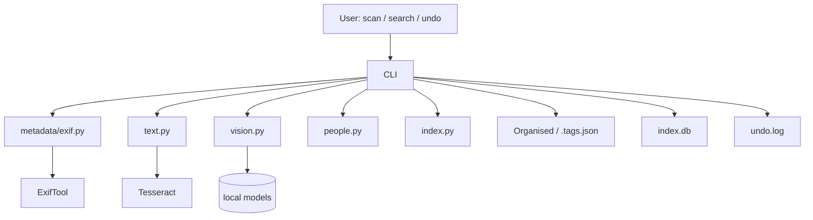

# Photo Archivist Agent

Bank-grade photo/document organiser. Read-only source, copies only, dry-run first,
every write logged + undoable. Full operating rules: see the spec PDF
(`OPERATING_CONTEXT.md` once added).

## Quickstart

```bash
pip install Pillow ImageHash numpy pypdf pikepdf python-docx openpyxl olefile typer pyyaml pytesseract pytest
brew install exiftool tesseract poppler   # macOS; apt on Linux

# 1. Dry run (writes nothing)
python -m photo_archivist.cli scan /path/to/source

# 2. Apply after approving the plan
python -m photo_archivist.cli scan /path/to/source --no-dry-run --yes

# 3. Search (every hit carries reason + provenance)
python -m photo_archivist.cli search "Indiranagar branch launch"
python -m photo_archivist.cli search "loan sanction letters from 2023"

# 4. Undo last batch
python -m photo_archivist.cli undo
```

Optional local-AI extras (`pip install -e .[ai-local]`): insightface,
sentence-transformers, open-clip-torch, torch. The default `mock` vision
backend makes zero claims; swap in `photo_archivist/core/vision_local.py`
following the `VisionBackend` interface. Faces never leave the machine.

## Layout

```
config.yaml             # all tunable DEFAULTs (thresholds, excludes, hardlink, models)
people_library.yaml     # confirmed names + org role map (MD -> Anita Rao ...)
photo_archivist/cli.py  # scan / search / undo
photo_archivist/core/
  detect.py fingerprint.py pipeline.py
  metadata/{exif,docs,video,fs,reconcile,place}.py
  text.py vision.py people.py place.py embed.py
  index.py decide.py organise.py search.py report.py pii.py
tests/  sample_data/  data/
```

Writes go to `Organised/` + `index.db` + sidecar `.tags.json` + `undo.log` only.

## People library (names + org roles, local only)

Two places hold people data — both stay on your machine and are **never uploaded**:

- **`config.yaml`** — baseline defaults:

  ```yaml
  people: {}        # confirmed names, e.g. "Anita Rao": "Managing Director"
  roles:            # role keyword -> person name
    MD: ""
    CFO: ""
  ```

- **`people_library.yaml`** (optional, wins over `config.yaml` if present) — same shape:

  ```yaml
  people:
    "Anita Rao": "Managing Director"
    "Karthik Nair": "Chief Financial Officer"
  roles:
    MD: "Anita Rao"
    CFO: "Karthik Nair"
  ```

**How it is used:**

1. During `search`, if the query mentions a role keyword (e.g. `MD signed letter`),
   `roles` resolves it to a person name and filters the index by that person —
   so `search "MD letter"` behaves like `search "Anita Rao letter"`.
2. Quoted names in a query (`search '"Anita Rao"'`) are treated as a person filter directly.
3. `people` names are attached to hits as provenance alongside face/region matches.


## Facial detection / people model — where to edit

`people: []` in the scan output means **no person data was found**, because people are only
filled from sources that exist:

1. **Embedded metadata** (works today): XMP `MWG:RegionInfo` / `PersonInImage` tags already
   inside the file — `photo_archivist/core/people.py::region_names()` reads them at
   confidence 0.99. Downloaded/social images rarely carry these.
2. **Local face recognition** (opt-in): a local vision backend detects faces, then
   `people.py::match_local()` cosine-matches face embeddings against your
   `people:` library. This path is **off by default** — `vision.backend: mock` makes zero
   claims, so `face_boxes` stay empty and `people` stays `[]`.

To enable real facial detection:

| What to edit | Where |
|---|---|
| Install local-AI deps | `pip install -e .[ai-local]` → insightface, onnxruntime (see `pyproject.toml` `[project.optional-dependencies] ai-local`) |
| Switch the backend | `config.yaml` → `vision.backend: local` (currently `mock`) |
| Face match strictness | `config.yaml` → `faces.match_threshold: 0.60`, `faces.local_only: true` |
| The model code itself | create `photo_archivist/core/vision_local.py` with `class LocalVision(VisionBackend)` — `vision.py::get_backend()` already imports it automatically and falls back to `mock` if the file is missing |
| Confirmed names to match against | `people_library.yaml` / `config.yaml` → `people:` (name → role) |
| Wiring into the pipeline | `photo_archivist/core/pipeline.py` (`# --- people ---` step) — call `match_local(face_embedding, library)` there once your backend emits face embeddings |

Faces are **local-only** (`faces.local_only: true`): embeddings never leave the machine.

## Reading the `search` output

```
Organised/Inbox/AkhilVerma.jpeg :: Cline / Images (from path) · 2026-10-05T22:37:20 (from fs_birthtime) · text match: Akhil
└─ organised path (or source path)   └─ reason: place (provenance) · date (provenance) · matched terms
```

- Every hit carries a `reason` built from provenance — where each fact came from
  (`path`, `exif`, `fs_birthtime`, face match, etc.).
- Queries are **filtered**, not just ranked: rows are kept only if they actually match a
  term (FTS prefix match, so `Akhil` finds `AkhilVerma.jpeg`, or substring across
  caption/tags/OCR/path/place/event).
- A query that matches nothing prints `No matches.` — expected for text that isn't in your
  library (e.g. `Indiranagar branch launch` on stock avatars with no OCR text).
- Year words (`2023`) are matched broadly against `taken_at`, OCR, caption, tags, and path.


## Dummy vs live — what is simulated and how to go fully real

Several components intentionally ship as **stubs** so the pipeline runs with zero AI
dependencies. Each is safe (it never fabricates confident claims) and has a defined upgrade path:

| # | Component | What runs today (dummy) | How to make it LIVE |
|---|---|---|---|
| 1 | **Vision / captions** | `config.yaml → vision.backend: mock` → `MockVision` echoes the path hint and appends `(mock vision — no claim)` to every caption. No objects, scenes, or faces detected. | ① `pip install -e .[ai-local]` ② create `photo_archivist/core/vision_local.py` with `class LocalVision(VisionBackend)` (Moondream/LLaVA/CLIP plug in here; `vision.py` auto-imports it and falls back to mock if missing) ③ set `vision.backend: local` ④ `undo` + re-scan so sidecars regenerate. |
| 2 | **Text embeddings** | `embed.py::text_vector` = SHA-256 bag-of-words hashed into 128 dims. Deterministic but **semantic-poor** (synonyms don't match). Stored in `index.db → txt_vec`. | `pip install sentence-transformers` (in the `ai-local` extra); replace the body of `text_vector()` with `SentenceTransformer("all-MiniLM-L6-v2").encode(text)` (dim 384). Then rebuild the index — stored vectors must all be recomputed. |
| 3 | **Image embeddings** | Always `null` — `pipeline.py` hardcodes `"image": None`, so visual similarity is inert (the `img_vec` column already exists, unused). | `pip install open-clip-torch` (in `ai-local`); compute a CLIP `ViT-B-32` embedding in `pipeline.py` beside `txt_vec` and pass it through `idx.upsert_file`. |
| 4 | **Reverse geocoding** | `place.py::reverse_geocode` is an explicit **offline stub**: returns `lat,lon` with `source: gps_reverse_geocode_offline_stub`, confidence 0.5. `data/` is empty — no gazetteer. | Download a GeoNames dump (e.g. `cities15000` + `alternateNamesV2`) and load it into SQLite at `config.yaml → geocode.offline_db` (`data/gazetteer.db`); `reverse_geocode(lat, lon, db_path)` already accepts the path. Online APIs are intentionally unsupported — GPS must not leave the machine. |
| 5 | **Face recognition / people** | Only embedded XMP `PersonInImage` tags are read. `faces:` config and `people.py::match_local()` exist but are never invoked → `people: []` for normal photos. | See *Facial detection / people model* above: install `ai-local`, write `vision_local.py` emitting face boxes + embeddings, wire `match_local()` into `pipeline.py`, fill `people:` names. |
| 6 | **Folder profiles / learning** | `scan` always starts with an empty profile list → every file is `new_folder` (lands in `Organised/Inbox/`). The `folders` table (centroids/tags/people per folder) is never written, so `thresholds.promote: 0.80` never fires. | After each apply, upsert each destination folder's centroid/tags/people into the `folders` table (schema already in `index.py`) and pass those profiles into `decmod.decide()` on the next scan. |
| 7 | **Role placeholders** | `config.yaml → roles: MD: "", CFO: ""` — empty strings mean role keywords (`"MD letter"`) resolve to no person filter. | Fill in real names (`MD: "Anita Rao"`), or maintain them in `people_library.yaml`, which overrides `config.yaml`. |
| 8 | **OCR** | ✅ **Live** on your machine (`/opt/homebrew/bin/tesseract`) — e.g. *"welcome mr. amol padhye"* is extracted from images and searchable. | Nothing to do. If missing: `brew install tesseract` / `apt install tesseract-ocr`. |
| 9 | **Metadata extraction** | ✅ **Live** (`exiftool` 13.55): EXIF, sizes, dates, permissions are all read for real. | Nothing to do. |

**Rule of thumb:** anything ending in `mock`, `stub`, `hash`, or `no claim` in the output is a
dummy. After changing any of the above, run `undo` (or delete `index.db` + `Organised/`) and
re-run `scan --no-dry-run --yes` — already-written sidecars and vectors are **not**
retroactively upgraded.

## What This Project Does

The Photo Archivist Agent organizes photos and documents into a semantic folder structure. It
extracts metadata (EXIF, XMP), runs OCR on scanned pages, analyzes visual content, generates tags
and captions, ranks files into existing folders or flags them for review, and indexes everything so
it can be searched later. All source files are read-only: the agent copies (or hardlinks) only into
an `Organised/` output tree and writes no files back to the source.

## Input / Output

### Inputs

- **Source directory** (`scan /path/to/source`): the folder of photos/documents to organize. The
  source tree itself is never modified.
- **`config.yaml`**: tunable defaults (thresholds, excludes, OCR backend, model names, etc.).
- **`people_library.yaml`** (optional): a small local YAML with a `roles` map (`MD`, `CFO`, ...)
  and a `people` map of confirmed names. This is used only to annotate search hits; it is **never
  uploaded** and is not part of the model.
- **`index.db`**: the existing photo index (created by a previous run) used by `search` and `undo`.

### Outputs

- **`Organised/`**: copies/hardlinks of the processed files arranged in semantic folders, plus
  per-file `.tags.json` sidecars containing captions, tags, scenes, and confidence scores.
- **`index.db`**: SQLite database of all indexed files, embeddings, tags, and provenance.
- **`undo.log`**: ordered list of write operations so a previous scan can be reverted with `undo`.
- **Dry run**: when `--no-dry-run` is not passed, `scan` prints the proposed plan to the terminal
  instead of writing anything.

## Architecture



The pipeline runs **read-only** against the source, then writes only to the outputs above. The
`search` command queries `index.db` and attaches a `reason` + `provenance` to every hit. `undo`
replays `undo.log` in reverse. All local AI (OCR, vision, embeddings) stays on the machine.
# Photo-Archivist-Agent
