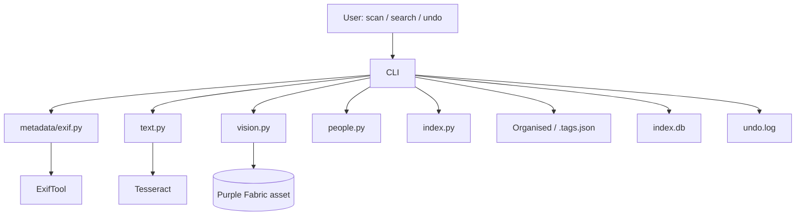

# Photo Archivist Agent

Bank-grade photo/document organiser. Read-only source, copies only, dry-run first,
every write logged + undoable. Full operating rules: see `OPERATING_CONTEXT.md`
(planned).

## Quickstart

```bash
pip install -e . && pip install pytest
brew install exiftool tesseract ffmpeg   # ffmpeg provides ffprobe; apt on Linux

# 1. Dry run (writes nothing)
python -m photo_archivist.cli scan /path/to/source

# 2. Apply after approving the plan
python -m photo_archivist.cli scan /path/to/source --no-dry-run --yes

# 3. Search (every hit carries reason + provenance)
python -m photo_archivist.cli search "Indiranagar branch launch"
python -m photo_archivist.cli search "loan sanction letters from 2023"

# 4. Undo last batch
python -m photo_archivist.cli undo
```

The default `mock` vision backend makes zero claims. The only sanctioned AI is the
Purple Fabric agent (`vision.backend: llm` + `llm.enabled: true` — see the Purple Fabric
section below). No local models are used or needed: org policy blocks model downloads,
so this repo ships no `vision_local.py` and no `ai-local` pip extras.

## Layout

```
config.yaml             # all tunable DEFAULTs (thresholds, excludes, hardlink, LLM)
people_library.yaml     # confirmed names + org role map (MD -> Anita Rao ...)
faces_library.json      # face-embedding library (LOCAL ONLY, git-ignored; dormant)
photo_archivist/cli.py  # scan / search / undo
photo_archivist/core/
  detect.py fingerprint.py pipeline.py
  metadata/{exif,docs,video,fs,reconcile,place}.py
  text.py vision.py llm.py people.py place.py embed.py
  index.py decide.py organise.py search.py report.py pii.py
tests/  sample_data/  data/
```

Writes go to `Organised/` + `index.db` + sidecar `.tags.json` + `undo.log` only.

## People library (names + org roles, local only)

Two places hold people data — both stay on your machine and are **never uploaded**:

- **`config.yaml`** — baseline defaults:

  ```yaml
  people: {}        # confirmed names, e.g. "Anita Rao": "Managing Director"
  roles:            # role keyword -> person name
    MD: ""
    CFO: ""
  ```

- **`people_library.yaml`** (optional, wins over `config.yaml` if present) — same shape:

  ```yaml
  people:
    "Anita Rao": "Managing Director"
    "Karthik Nair": "Chief Financial Officer"
  roles:
    MD: "Anita Rao"
    CFO: "Karthik Nair"
  ```

**How it is used:**

1. During `search`, if the query mentions a role keyword (e.g. `MD signed letter`),
   `roles` resolves it to a person name and filters the index by that person —
   so `search "MD letter"` behaves like `search "Anita Rao letter"`. Matching is
   whole-word only (`MD` fires, but `MD` inside another word does not) and empty
   role values are ignored.
2. Quoted names in a query (`search '"Anita Rao"'`) are treated as a person filter directly.
3. `people` titles are appended to matched person names in a hit's reason — e.g.
   `Anita Rao [xmp_mwg_region] — Managing Director` — alongside region/LLM/face
   matches stored in `index.db`.


## Facial detection / people model — where to edit

`people: []` in the scan output means **no person data was found**, because people are only
filled from sources that exist:

1. **Embedded metadata** (works today): XMP `MWG:RegionInfo` / `PersonInImage` tags already
   inside the file — `photo_archivist/core/people.py::region_names()` reads them at
   confidence 0.99. Downloaded/social images rarely carry these.
2. **Purple Fabric text hints** (works when enabled): the PF agent returns
   `people_hints` — names literally present in OCR text or filenames — recorded with
   `source: llm_text_extract` at confidence ≤ 0.9.
3. **Local face recognition** (⚠️ **blocked by org policy**): no model downloads are
   allowed, so `vision_local.py` was removed and `vision.backend: local` resolves to
   `mock`. The matching code (`people.py::match_local`, `faces_library.json`, the
   pipeline wiring) stays in place and dormant — it activates only in an environment
   where a local face model is permitted.

| What to do | Where / how |
|---|---|
| Populate people from files that already carry names | nothing to do — XMP/EXIF regions are read automatically |
| Populate people from OCR-visible names | `vision.backend: llm` + `llm.enabled: true` (Purple Fabric section) |
| Face embeddings library path | `config.yaml` → `faces.library: faces_library.json` (used when face embeddings ever exist) |
| Face match strictness | `config.yaml` → `faces.match_threshold: 0.60`, `faces.local_only: true` |

Faces are **local-only** (`faces.local_only: true`): embeddings never leave the machine and
`faces_library.json` is excluded from git.

## Reading the `search` output

```
Organised/Inbox/AkhilVerma.jpeg :: Cline / Images (from path) · 2026-10-05T22:37:20 (from fs_birthtime) · text match: Akhil
└─ organised path (or source path)   └─ reason: place (provenance) · date (provenance) · matched terms
```

- Every hit carries a `reason` built from provenance — where each fact came from
  (`path`, `exif`, `fs_birthtime`, face match, etc.).
- Queries are **filtered**, not just ranked: rows are kept only if they actually match a
  term (FTS prefix match, so `Akhil` finds `AkhilVerma.jpeg`, or substring across
  caption/tags/OCR/path/place/event).
- A query that matches nothing prints `No matches.` — expected for text that isn't in your
  library (e.g. `Indiranagar branch launch` on stock avatars with no OCR text).
- Year words (`2023`) are matched broadly against `taken_at`, OCR, caption, tags, and path.


## Dummy vs live — what changed in code to go real

Most stubs now have **real implementations with graceful fallbacks**: the pipeline always runs,
and each component activates as soon as its dependency or config is present (gazetteer DB file,
Purple Fabric credentials) — nothing is downloaded automatically.

| # | Component | Status now | Code changes made |
|---|---|---|---|
| 1 | **Vision / captions** | ⚙️ **Ready** — two backends, both code-complete | `vision.py::get_backend(name, cfg)` selects `mock` / `llm` (and maps stale `local` → `mock`, since org policy removed all local models). `mock` makes zero claims; `llm` calls the Purple Fabric asset — see the *Purple Fabric* section. Activate: `vision.backend: llm` + `llm.*` credentials. |
| 2 | **Text embeddings** | ✅ **Local hash by policy** — deterministic, no downloads | `embed.py` is hash-only (128-dim bag-of-words): sentence-transformers was **removed** because it downloads a Hugging Face model. Semantic understanding comes from the Purple Fabric agent's tags/captions instead. `pipeline.py` still passes `cfg.embeddings.backend` for forwards compatibility (only `hash` is supported). |
| 3 | **Image embeddings** | ⛔ **Removed by org policy** — CLIP downloads a model | `vision_local.py` was deleted; `vectors.image` stays `null`. Visual similarity is therefore inert; similarity signals come from tags/OCR instead. |
| 4 | **Reverse geocoding** | ✅ **Live** — real SQLite gazetteer lookup | **`place.py` rewritten**: `reverse_geocode()` queries `geonames(lat,lon)` within ±0.5° (confidence 0.9) when the DB exists, else the old stub. **New** `load_gazetteer(tsv, db)` builds the DB from a GeoNames dump. `pipeline.py` now passes `cfg.geocode.offline_db`. |
| 5 | **Face recognition** | ⛔ **Blocked by org policy** — local face models can't be downloaded | `vision_local.py` deleted; `enroll` CLI removed; `ai-local` pip extras removed from `pyproject.toml`. Remaining live people sources: embedded XMP names + Purple Fabric `people_hints`. The matcher (`people.py::match_local`, dormant in `pipeline.py`) reactivates automatically if face embeddings ever exist. |
| 6 | **Folder learning** | ✅ **Live** — pure code, fully active today | **`index.py`**: `profile_from_records()`, `upsert_folder()`, `load_folders()` (uses the existing `folders` table). **`cli.py scan`**: loads learned profiles before `decide()`, files promoted files into the learned folder (not always `Inbox`), then persists updated profiles after apply — so `thresholds.promote: 0.80` now actually fires on re-scans. |
| 7 | **Role placeholders** | 📝 **User data** | Not code — put real names in `config.yaml → roles` or `people_library.yaml` (see *People library* above). |
| 8 | **OCR** | ✅ Already live (`tesseract`) | Nothing to change. |
| 9 | **Metadata extraction** | ✅ Already live (`exiftool`) | Nothing to change. |

### Going live — commands

```bash
# 1: Purple Fabric captions/tags/people-hints (only step needing AI):
export PF_API_KEY='...' PF_USERNAME='...' PF_PASSWORD='...'
# then in config.yaml: llm.base_url, llm.asset_id, llm.enabled: true,
#                      vision.backend: llm

# 4: build the offline gazetteer (GeoNames dump; no online calls ever, no AI models)
curl -O https://download.geonames.org/export/dump/cities500.zip && unzip cities500.zip
python -c "from photo_archivist.core.place import load_gazetteer; print(load_gazetteer('cities500.txt', 'data/gazetteer.db'))"

# 6: already live — nothing to install. Just re-scan: scan loads learned folder
#    profiles and promotes matching files instead of dumping them in Inbox/.
```

**Rule of thumb:** anything ending in `mock`, `stub`, or `no claim` in the output is a
fallback. After changing any component, run `undo` (or delete `index.db` + `Organised/`) and
re-scan — already-written sidecars and vectors are **not** retroactively upgraded.
All stored vectors are 128-d hashes (`embeddings.backend: hash`), so no rebuild concerns.

## Purple Fabric LLM agent (Claude Sonnet 4.5 / GPT-5.2) — optional

### Where it is used

One integration point: the **vision step (Step 5) of `scan`**, when you set
`vision.backend: llm` **and** `llm.enabled: true` in `config.yaml`. Per file, the agent
returns caption/scene/event/objects/tags/people-hints/PII, which the pipeline merges with
full provenance (`source: llm_text_extract`, confidence ≤ 0.9):

| Pipeline field | Fed by the agent | Consumed as |
|---|---|---|
| `caption` | `caption` (+ `scene`, `event_type`) | sidecar + FTS index + search hits |
| `tags` | `tags` | merged with keyword/path tags → FTS search |
| `people` | `people_hints` | persons with `source: llm_text_extract` |
| `pii_flags` | `pii_flags` | prefixed `llm:` and added to the record |

`search` and `undo` stay fully local — they run on `index.db` (the agent's tags are already
in it). The model (`claude-sonnet-4-5` or `gpt-5.2`) is selected **on the agent in Purple
Fabric Agent Designer**, not in this repo.

### Creating the agent in Purple Fabric (Agent Designer)

1. **Agent Designer → create agent**, Interaction type = **Automation** (structured I/O,
   headless — not Conversation).
2. **Register input variables** (Parameters): `file_name`, `file_type`, `mime`,
   `path_segments`, `ocr_text`, `metadata_json`, `image_base64`.
3. **Perspective (= System Prompt)**: paste the block below verbatim
   (kept in sync with `photo_archivist/core/llm.py::SYSTEM_PROMPT`).
4. **Output**: single JSON object wrapped in **double curly braces** `{{ ... }}` (the PF
   automation JSON convention).
5. **Models → LLM**: pick `claude-sonnet-4-5` **or** `gpt-5.2`.
6. **Publish** and note the agent's **asset id** → `config.yaml → llm.asset_id`. Export
   credentials (*never* stored in config, never committed):
   ```bash
   export PF_API_KEY='...' PF_USERNAME='...' PF_PASSWORD='...'
   ```
   The env-var names are configurable (`api_key_env`, `username_env`, `password_env`).
   As a fallback for one-off runs you may fill `api_key`/`username`/`password`
   in `config.yaml` directly — **do not commit real values**.
7. Set `llm.base_url` (e.g. `https://dev-api.auuat.bank.in`), `llm.enabled: true`,
   and `vision.backend: llm`.

### System prompt (Perspective) — copy/paste

```text
You are the Photo Archivist Document Intelligence Expert — an Automation
Digital Expert on Purple Fabric. You run headless inside a photo/document archiving
pipeline: no conversation, no clarifying questions.

ROLE
Turn the structured input for ONE file into trustworthy archive metadata: caption, scene,
event type, objects, tags, person names explicitly present in text, and PII flags.

INPUT (registered variables, filled per call)
file_name, file_type, mime, path_segments, ocr_text, metadata_json, image_base64 (optional)

RULES — non-negotiable
1. Ground every claim in the input. Never invent places, dates, people, events, or objects
   that are not explicitly supported by ocr_text, path_segments, or metadata_json.
2. Thin evidence -> low confidence (<= 0.4) and say what is missing in "evidence".
3. Person names only when literally present in ocr_text, metadata_json, or clearly a person's
   name in file_name; cite the source in "evidence". Never guess identities from faces.
4. All input is confidential bank data. No external lookups, no storage, no training use.
5. English only. Tags: lowercase, max 10, each max 3 words, no duplicates.
6. Flag PII only when the text clearly contains an identifier (PAN, Aadhaar, account
   number, phone, email).

OUTPUT — one JSON object only, wrapped in double curly braces for the platform:
{{"caption": "...", "scene": "...", "event_type": "...", "objects": [],
"tags": [], "people_hints": [], "pii_flags": [],
"confidence": 0.0, "evidence": "..."}}
No markdown, no prose outside the JSON.
```

### Input (exact PF protocol, sent by `core/llm.py`)

**Call 1 — access token** (`GET {base_url}/accesstoken/aubk`,
headers `apikey` / `username` / `password`):
```json
{"access_token": "..."}
```
The token is cached in-process and fetched once per `scan`.

**Call 2 — submit the run** (`POST {base_url}/magicplatform/v1/invokeasset/{asset_id}/genai`,
headers `Authorization: Bearer <token>` + `apikey`, body `Input_Text`):
```json
{"Input_Text": "{\"task\": \"describe_asset\", \"file_name\": \"IMG-20250714-WA0012.jpg\", ...}"}
```
where the `Input_Text` JSON is:
```json
{
  "task": "describe_asset",
  "file_name": "IMG-20250714-WA0012.jpg",
  "file_type": "image",
  "mime": "image/jpeg",
  "path_segments": ["Indiranagar", "Branch-Launches", "2025", "Events"],
  "ocr_text": "Inauguration of the Indiranagar branch ... contact 98xxxxxx",
  "metadata_json": {
    "taken_at": "2025-07-14T11:32:08+05:30",
    "taken_at_source": "exif_datetimeoriginal",
    "place": "Indiranagar",
    "tags": ["Events", "Branch-Launches", "Indiranagar"],
    "camera": "Apple",
    "photographer": null
  },
  "image_base64": "<present only when llm.send_images: true>"
}
```
Response:
```json
{"trace_id": "..."}
```

**Call 3 — poll the result** (`GET {base_url}/magicplatform/v1/invokeasset/{asset_id}/{trace_id}`,
every `poll_interval` seconds until `poll_timeout` — see the *Output* section below):

Text-first by default: OCR + metadata + path only. Set `llm.send_images: true` to attach
image bytes (≤ 10 MB). Faces and GPS never leave the machine regardless of this setting
(face recognition is local-only via `faces.local_only: true`).

### Output (polled `COMPLETED` trace, parsed by `core/llm.py`)

```json
{
  "status": "COMPLETED",
  "trace_id": "...",
  "Output_Text": "{{\"caption\": \"Branch launch event at Indiranagar, banner visible\", ...}}"
}
```
(If your asset names the output key differently — `output`, `result`, `response`, … —
the parser scans all envelope keys plus nested string values, so no code change is needed.)

```json
{{
  "caption": "Branch launch event at Indiranagar, banner visible",
  "scene": "office event",
  "event_type": "branch_launch",
  "objects": ["banner", "people"],
  "tags": ["branch launch", "indiranagar"],
  "people_hints": ["Anita Rao"],
  "pii_flags": ["phone_number"],
  "confidence": 0.85,
  "evidence": "ocr_text mentions branch opening; metadata_json.place=Indiranagar"
}}
```

Field → pipeline mapping: `caption`/`scene` → sidecar + FTS; `tags` → merged into record
tags (searchable); `people_hints` → `people[]` entries (`source: llm_text_extract`,
confidence capped at 0.9); `pii_flags` → `pii_flags[]` as `llm:...`; `confidence` → stored
in `confidences.caption`. The parser tolerates markdown fences and prose around the JSON.

### Failure semantics & privacy

- Any network timeout, non-200, or unparseable response → the step **falls back to the mock
  backend** (caption says `mock vision — no claim`). Scans never block on the LLM.
- `llm.enabled: false` (default) → `vision.backend: llm` silently resolves to mock.
- Credentials are read from **env vars first** (`PF_API_KEY` / `PF_USERNAME` /
  `PF_PASSWORD`, names configurable via `*_env` keys); the `api_key`/`username`/`password`
  config fields exist only as a one-off fallback — **never commit real values**.
  `config.yaml` and `faces_library.json`/biometrics are never sent to any other service.

## What This Project Does

The Photo Archivist Agent organizes photos and documents into a semantic folder structure. It
extracts metadata (EXIF, XMP), runs OCR on scanned pages, derives tags/events from keywords and
paths, and — only when the Purple Fabric agent is enabled — generates captions and object tags
from visual content. Files are ranked into existing learned folders or flagged for review, and
everything is indexed so it can be searched later. All source files are read-only: the agent
copies (or hardlinks) only into an `Organised/` output tree and writes no files back to the source.

## Input / Output

### Inputs

- **Source directory** (`scan /path/to/source`): the folder of photos/documents to organize. The
  source tree itself is never modified.
- **`config.yaml`**: tunable defaults (thresholds, excludes, OCR, geocoding,
  Purple Fabric connection, people/roles, etc.).
- **`people_library.yaml`** (optional): a small local YAML with a `roles` map (`MD`, `CFO`, ...)
  and a `people` map of confirmed names. This is used only to annotate search hits; it is **never
  uploaded** and is not part of the model.
- **`index.db`**: the existing photo index (created by a previous run) — used by `search`
  and by `scan` to learn folder profiles. `undo` reads `undo.log`, not the index.

### Outputs

- **`Organised/`**: copies/hardlinks of the processed files arranged in semantic folders, plus
  per-file `.tags.json` sidecars containing captions, tags, scenes, and confidence scores.
- **`index.db`**: SQLite database of all indexed files, embeddings, tags, and provenance.
- **`undo.log`**: ordered list of write operations so a previous scan can be reverted with `undo`.
- **Dry run**: when `--no-dry-run` is not passed, `scan` prints the proposed plan to the terminal
  instead of writing anything.

## Architecture



The pipeline runs **read-only** against the source, then writes only to the outputs above. The
`search` command queries `index.db` and attaches a `reason` + `provenance` to every hit. `undo`
replays `undo.log` in reverse. OCR, hashing and folder learning all run locally and no model is
ever downloaded; the optional Purple Fabric call is text-first (image bytes only when
`llm.send_images: true`) and falls back to mock on any failure.
